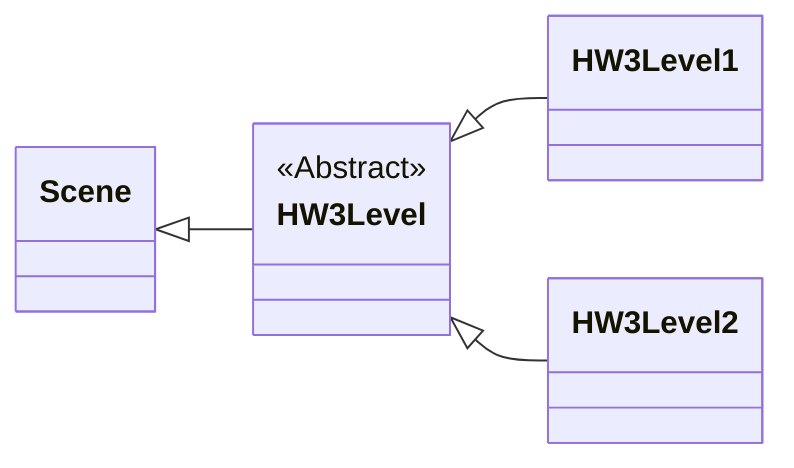
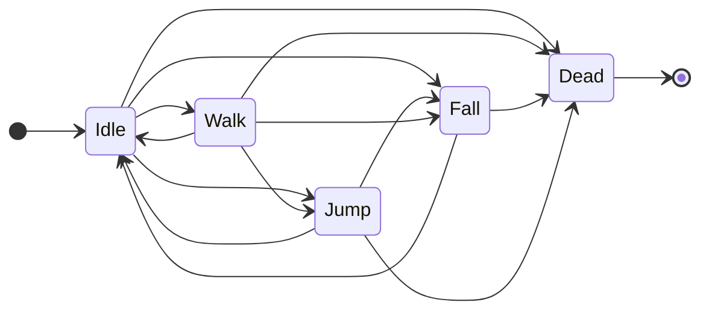

# Homework 3 - CSE 380 - Spring 2023
- Professor Richard McKenna - richard@cs.stonybrook.edu
- Joe Weaver - hweaver@cs.stonybrook.edu
- Zachary Grandison - zgrandison@cs.stonybrook.edu
- Peter Walsh - peter.t.walsh@stonybrook.edu
- Kevin Cai - kevin.cai@stonybrook.edu
- Andrew Ojeda - atojeda@cs.stonybrook.edu
### Due Date: Friday, March 3, 2023

## Introduction
> First of all, massive shoutout to my friend Andrew Ojeda for making the :fire: level music for this assignment :heart_eyes:. The pacing of the gameplay doesn't quite match the music yet, but I'm going to fix that hopefully soon.

In this assignment, you will make a simple platformer game using the Typescript programming language and the Wolfie2D game engine. By completing this assignment, you should start to become familiar with the Wolfie2D game engine and develop an understanding of:

* How to work with Wolfie2Ds physics system
  * Adding physics to game nodes
  * Creating collision groups and triggers
  * Add collidable layers to tilemaps
  * Apply collision groups to tilemaps
* How to play sounds and level music in Wolfie2D
* How to create simple AI using finite state machines
* Resource management 

## How to Play
The platformer for this homework assignment was loosely inspired by Kevin's game from last semester (DoodleFin) and Terraria. The controls for the game are pretty bare-bones:

- W: Jump
- A: Move left
- D: Move right
- X: Attack (probably going to change this)

You should notice the attack button launches a burst of particles to the right of the player's sprite. There are no enemies in the game trying to kill you, but there is fall damage. The player's health is indicated by the healthbar in the top-right corner. The goal of the game is to make it to the level-end area, indicated by the purple box, without dying.

> Great game ideas like this is why I lean more towards game programming than design 😄

## Codebase Files
The directory structure of the homework codebase looks similar to the tree diagram shown below.
```
.
├── README.md
├── dist
├── gulpfile.js
├── package-lock.json
├── package.json
├── src
│   ├── Wolfie2D
│   ├── hw3
│   │   ├── Factory
│   │   │   ├── HW3CanvasNodeFactory.ts
│   │   │   └── HW3FactoryManager.ts
│   │   ├── HW3Controls.ts
│   │   ├── HW3Events.ts
│   │   ├── HW3PhysicsGroups.ts
│   │   ├── Nodes
│   │   │   └── HW3AnimatedSprite.ts
│   │   ├── Player
│   │   │   ├── PlayerController.ts
│   │   │   ├── PlayerStates
│   │   │   │   ├── Dead.ts
│   │   │   │   ├── Fall.ts
│   │   │   │   ├── Idle.ts
│   │   │   │   ├── Jump.ts
│   │   │   │   ├── PlayerState.ts
│   │   │   │   └── Walk.ts
│   │   │   └── PlayerWeapon.ts
│   │   └── Scenes
│   │       ├── HW3Level.ts
│   │       ├── HW3Level1.ts
│   │       ├── HW3Level2.ts
│   │       └── MainMenu.ts
│   ├── index.d.ts
│   ├── index.html
│   └── main.ts
└── tsconfig.json
```

## Codebase Structure
The homework code for this assignment is structured a bit differently than the code in the previous assignment.

### Multiple Levels
Instead of a single, custom scene class, we've defined an abstact class called `HW3Level` extending the base Scene class with two subclasses; `HW3Level1` and `HW3Level2`. The heirarchy is shown roughly in the diagram below. I have omitted the methods and fields from the diagram for the sake of keeping things simple.


Most of the heavy lifting is done in the abstract HW3Level class. The subclasses will ultimately have to override and implement some functionality to get things working.

### Player StateMachine
The controller for the Player has been configured as a simple finite state machine. The player's state machine has a total of five states:

- Idle
- Walking
- Jumping
- Falling
- Dead

The transitions between the different states have been modelled after the state diagram shown below. You should notice the diagram is a bit messy. StateMachine AI can very quickly become a tangled mess, and in practice, become very difficult to scale. Watch out for this as you're making your games.



## Part 1 - Playing Sound Effects
For this assignment, you'll have use Wolfie2d's audio system to play your custom sound effects and level music. Interfacing with Wolfie2d's sound system can be done via the EventQueue. The types of events and the data associated with them are shown below.
```typescript
enum GameEventType {

    /**
     * Play Sound event. Has data: {key: string, loop: boolean, holdReference: boolean }
     */
    PLAY_SOUND = "play_sound",

    /**
     * Play Sound event. Has data: {key: string}
     */
    STOP_SOUND = "stop_sound",

    /**
     * Play Sound event. Has data: {key: string, loop: boolean, holdReference: boolean, channel: AudioChannelType }
     */
    PLAY_SFX = "play_sfx",

    /**
     * Play Sound event. Has data: {key: string, loop: boolean, holdReference: boolean }
     */
    PLAY_MUSIC = "play_music",

    /**
     * Mute audio channel event. Has data: {channel: AudioChannelType}
     */
    MUTE_CHANNEL = "mute_channel",

    /**
     * Unmute audio channel event. Has data: {channel: AudioChannelType}
     */
    UNMUTE_CHANNEL = "unmute_channel"
    
}
```
For the most part you only have to worry about using the `PLAY_SOUND` and `STOP_SOUND` events.

### Part 1.1 - Playing Sound Effects
For this assignment, there are a few sound effects that should be played in response to different game events.

- The player entering the `Jump` state, should trigger a jump sound effect
- A particle colliding with the destructible layer of the tilemap should trigger a sound effect

### Part 1.2 - Level 2 Music
When the game transitions to the second level, you should notice the music

## Part 2 - Physics
In the first homework assignment, all of the physics, movement, and collision detection was done manually in the custom scene class. For this assignment, we'll be adding a physics component to all of our game nodes and using the Wolfie2D's physics system to move our game nodes. If you want to move a game node using Wolfie2D's physics system, you have to use the `Physical.move()` method on the game node.
```typescript
interface Physical {
    /**
     * Tells the physics engine to handle a move by this object.
     * @param velocity The velocity with which to move the object.
     */
    move(velocity: Vec2): void;
}
```
A word of caution; Calling the `move()` method and updating the position field of a game node are **NOT** the same thing :scream: 

Moving a game node by updating it's position field is the equivalent of "teleporting" that game node, whereas calling the the `move()` method is how you actually "move" the node. If your game is using physics, you should be calling the move method.

> A lot of the methods and functionality you'll have to use to complete this assignment are defined in Wolfie2Ds `Physical` interface. I recommend taking a look at the methods and documentation in that interface :wink:

## Part 2.1 - Adding Physics to GameNodes
For this assignment, you'll need to make sure all of your nodes have physical components and are registered with the physics system. This includes:

- The player's sprite
- All of the particles in the player's weapon particle system
- The sprite for the player's weapon
- The ground and destructible layers of the tilemap

In Wolfie2D, if you want to add a physics component to your game node, you can call the `Physical.addPhysics()` method on the game node. The method has several optional parameters you can pass to it. 

```typescript
/**
 * Adds physics to this object
 * @param collisionShape The shape of this collider for this object
 * @param isCollidable Whether this object will be able to collide with other objects
 * @param isStatic Whether this object will be static or not
 */
addPhysics(collisionShape?: Shape, colliderOffset?: Vec2, isCollidable?: boolean, isStatic?: boolean): void;
```

## Part 2.2 - Creating Physics Groups and Triggers
For this homework assignment, you'll have to configure the physics groups and collision map for the scene. There are four collision groups that need to be accounted for:
1. Ground: the group for thhe indestructible layer of the tilemap
2. Player: the group for the player
3. Weapon: the group for the particles in the player's weapon system
4. Destructible: the group for destructible layer of the tilemap

The collision map for the five groups should resemble the table shown below:

|              | Ground | Player | Weapon | Destructible |
|--------------|--------|--------|--------|--------------|
| Ground       | No     | Yes    | Yes    | No           | 
| Player       | Yes    | No     | No     | Yes          |
| Weapon       | Yes    | No     | No     | Yes          | 
| Destructible | No     | Yes    | Yes    | No           | 

Currently, the way you have to configure physics groups and triggers is by passing in physics groups is through the scene options that get passed to the scene constructor. 
```typescript
// Here's a constructor for a custom scene class extending the base scene class
public constructor(viewport: Viewport, sceneManager: SceneManager, renderingManager: RenderingManager, options: Record<string, any>) {

    // Pass the physics groups into the super class constructor via the scene options parameter
    super(viewport, sceneManager, renderingManager, {...options, physics: { /* Physics groups/data here */ }});
    
}
```
The `physics` object that can be passed into the scene options has the following format:
```typescript
type PhysicOptions = {

  // The names of the collision groups to add to the physics manager for this scene
  groupNames: string[];
  
  // The collision map for the different collision groups
  collisions: number[][];
  
}
```
Each group in `groupNames` will get a row/column in the collision map. 

## Part 2.3 - Assigning Physics Groups and Triggers
For this assignment you'll need to assign different types of game nodes to different collision groups.

* The player should be assigned to the Player physics group
* All particles in the particle pool for the player's particle weapon should be assigned to the Weapon physics group

Physics groups can be assigned to game nodes using the `Physical.setGroup()` method. 

```typescript
interface Physical {
    /**
     * Sets the physics group of this node
     * @param group The name of the group
     */
    setGroup(group: string): void;
}
```

In addition, you'll most likely want to set events to be fired when collisions occur between the objects in the different physics groups. You can assign collision triggers to nodes using the `Physical.setTrigger()` method. 

```typescript 
interface Physical {
    /**
     * Sets this object to be a trigger for a specific group
     * @param group The name of the group that activates the trigger
     * @param onEnter The name of the event to send when this trigger is activated
     * @param onExit The name of the event to send when this trigger stops being activated
     */
    setTrigger(group: string, onEnter: string, onExit: string): void;
}
```

When the physics system detects a collision between a game node and one of it's trigger groups, an event will be fired to the EventQueue with the name of the event passed to the `onEnter` field of the `setTrigger()` method and the following data:

```typescript
type TriggerEventData = {

  // The id of the node in the collision with a trigger event
  node: number
  
  // The id of the other node in the collision
  other: number
  
}
```
By default, all GameNodes are assigned to the default physics group (-1) and will collide with everything. If you start to set collision groups for the different nodes before configuring the collision map, you should notice objects will start to pass through each other. 

## Part 3 - Particle Systems
In this homework assignment, you will have to work with an extension of Wolfie2Ds particle system. The particle system used in this assignment is located in the `PlayerWeapon.ts` file. The `PlayerWeapon` extends the base `ParticeSystem` class and looks similar to the code shown below.

```typescript
/**
 * The particle system used for the player's weapon
 */
export default class PlayerWeapon extends ParticleSystem {

    /**
     * @returns true if the particle system is running; false otherwise.
     */
    public isSystemRunning(): boolean { return this.systemRunning; }

    /**
     * Sets the animations for a particle in the player's weapon
     * @param particle the particle to give the animation to
     */
    public setParticleAnimation(particle: Particle) {
        // Implementation not shown
    }

}
```
For this part of the assignment, you'll need to adapt the `PlayerWeapon` particle system to support some additional functionality. You may add any additional fields and methods you need to the `PlayerWeapon` class to get things working. Before you go adding functionaility to the custom PlayerWeapon particle system, I recommend seeing what fields and/or methods you could possibly override and/or expose from the base ParticleSystem class.

### Part 3.1 - Rotating the particles
Currently, the particle effect triggered by the player's attack always fires to the right. You need to adapt the particle system, so that the particles are fired in the direction of the position the mouse was at when the attack button was pressed (similar to the image shown below). The particles should **NOT** follow the mouse around the screen.

<p align="center">

</p>

### Part 3.2 - Particle Collision Group
In order to get the collision detection working for the player's particle system, you need to set the physics group for each particle in the particle system. You can set the physics group of a GameNode using the `Physical.setGroup(group: string)` method. 

## Part 4 - Tweening

### Part 4.1 - Do a Flip
Add a tween to your player's sprite to make them do a flip. Which property(s) you need to tween 

## Part 6 - Resource Management
For this assignment, you need to decide which resources to keep in the ResourceManager for the next scene and which resources to cull.

In this assignment there are two levels (Level1 and Level2). At the start of each level, we tell the ResourceManager what assets to load in before the Scene starts (sprites, tilemaps, audio files, etc.) in the `loadScene()` method. 

```typescript
class HW3Level1 {
    /**
     * Load in our resources for level 1
     */
    public loadScene(): void {
        // Load in the tilemap
        this.load.tilemap(this.tilemapKey, Level1.TILEMAP_PATH);
        
        // Load in the player's sprite
        this.load.spritesheet(this.playerSpriteKey, Level1.PLAYER_SPRITE_PATH);
        
        // Audio and music
        this.load.audio(this.levelMusicKey, Level1.LEVEL_MUSIC_PATH);
        this.load.audio(this.jumpAudioKey, Level1.JUMP_AUDIO_PATH);
        this.load.audio(this.tileDestroyedAudioKey, Level1.TILE_DESTROYED_PATH);
    }
}
```
```typescript
class HW3Level2 {
    /**
     * Load in resources for level 2.
     */
    public loadScene(): void {
        // Load in the tilemap
        this.load.tilemap(this.tilemapKey, Level2.TILEMAP_PATH);
        
        // Load in the player's sprite
        this.load.spritesheet(this.playerSpriteKey, Level2.PLAYER_SPRITE_PATH);
        
        // Audio and music
        this.load.audio(this.levelMusicKey, Level2.LEVEL_MUSIC_PATH);
        this.load.audio(this.jumpAudioKey, Level2.JUMP_AUDIO_PATH);
        this.load.audio(this.tileDestroyedAudioKey, Level2.TILE_DESTROYED_PATH);
    }
}
```

When the level ends, the ResourceManager (by default) expunges all of the assets we loaded in for a given scene. In a game where we are reusing the same assets over and over again across muliple scenes, constantly unloading and reloading the assets back in can become expensive. 

You need to tell the ResourceManager not to expunge the resources in Level1 that get used in Level2. You should also make sure not to load in any resources in Level2 that have already been loaded in Level1. 


