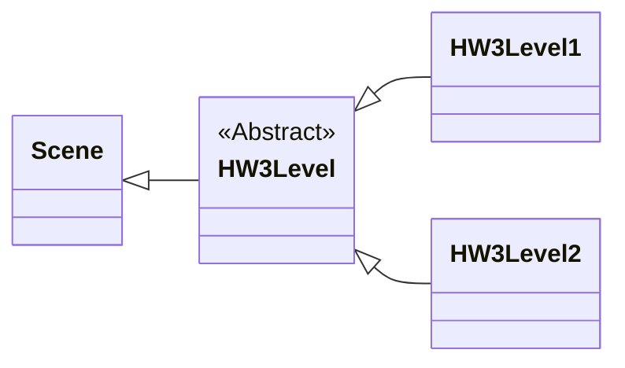
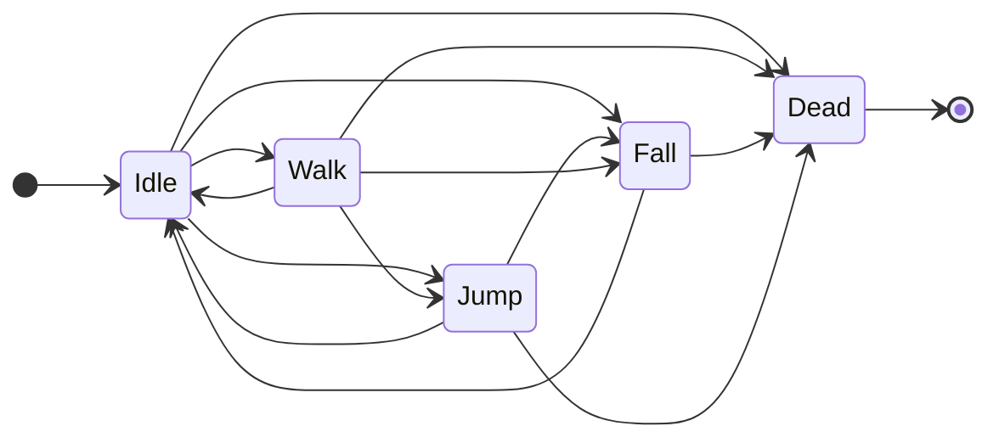

# Homework 3 - CSE 380 - Spring 2023
- Professor Richard McKenna - richard@cs.stonybrook.edu
- Joe Weaver - hweaver@cs.stonybrook.edu
- Zachary Grandison - zgrandison@cs.stonybrook.edu
- Peter Walsh - peter.t.walsh@stonybrook.edu
- Kevin Cai - kevin.cai@stonybrook.edu
- Andrew Ojeda - atojeda@cs.stonybrook.edu
### Due Date: Friday, March 3, 2023

## Introduction
> Massive shoutout to my friend Andrew Ojeda for making the :fire: level music for this assignment :heart_eyes:

In this assignment, you will make a simple platformer game using the Typescript programming language and the Wolfie2D game engine. By completing this assignment, you should start to become familiar with the Wolfie2D game engine and develop an understanding of:

* How to work with Wolfie2Ds physics system
  * Adding physics to game nodes
  * Creating collision groups and triggers
  * Add collidable layers to tilemaps
  * Apply collision groups to tilemaps
* How to play sounds and level music in Wolfie2D
* How to create simple AI using finite-state machines
* Resource management 

## How to Play
The platformer for this homework assignment was inspired by Kevin's game from last semester (DoodleFin) and Terraria. The controls for the game are pretty bare-bones:

- W: Jump
- A: Move left
- D: Move right
- X: Attack (probably going to change this)

You should notice the attack button launches a burst of particles to the right of the player's sprite. There are no enemies in the game trying to kill you, but there is fall damage. The player's health is displayed by the health bar in the top-right corner. The goal is to make it to the level-end area, indicated by the purple box, without dying.

> Great game ideas like this are why I lean more toward game programming than design 😄

## Codebase Files
The directory structure of the homework codebase looks similar to the tree diagram shown below.
```
.
├── README.md
├── dist
├── gulpfile.js
├── package-lock.json
├── package.json
├── src
│   ├── Wolfie2D
│   ├── hw3
│   │   ├── Factory
│   │   │   ├── HW3CanvasNodeFactory.ts
│   │   │   └── HW3FactoryManager.ts
│   │   ├── HW3Controls.ts
│   │   ├── HW3Events.ts
│   │   ├── HW3PhysicsGroups.ts
│   │   ├── Nodes
│   │   │   └── HW3AnimatedSprite.ts
│   │   ├── Player
│   │   │   ├── PlayerController.ts
│   │   │   ├── PlayerStates
│   │   │   │   ├── Dead.ts
│   │   │   │   ├── Fall.ts
│   │   │   │   ├── Idle.ts
│   │   │   │   ├── Jump.ts
│   │   │   │   ├── PlayerState.ts
│   │   │   │   └── Walk.ts
│   │   │   └── PlayerWeapon.ts
│   │   └── Scenes
│   │       ├── HW3Level.ts
│   │       ├── HW3Level1.ts
│   │       ├── HW3Level2.ts
│   │       └── MainMenu.ts
│   ├── index.d.ts
│   ├── index.html
│   └── main.ts
└── tsconfig.json
```

## Codebase Structure

### Multiple Levels
Instead of a single, custom scene class, we've defined an abstract class called `HW3Level` extending the base Scene class with two subclasses; `HW3Level1` and `HW3Level2`. The hierarchy is shown roughly in the diagram below. I have omitted the methods and fields from the diagram for the sake of keeping things simple.


Most of the heavy lifting is done in the abstract HW3Level class. The subclasses will ultimately have to override and implement some functionality to get things working.

### Player StateMachine
The controller for the player is a simple finite-state machine. The player's state machine has a total of five states:

- Idle
- Walking
- Jumping
- Falling
- Dead

The transitions between the different states have been modeled after the state diagram shown below. The state diagram is a bit messy. StateMachine AI can very quickly become a tangled mess and in practice become very difficult to scale. Watch out for this as you're making your games.



Wolfie2d's state-machine is based on the [State](https://gameprogrammingpatterns.com/state.html) chapter from your textbook, [*Game Programming Patterns*](https://gameprogrammingpatterns.com/). 

## Part 1 - Animated Sprites
For this assignment, you'll need to load in the custom hero animated sprite you made for homework 1. To do this, you'll need to change the sprite loaded in via the `loadScene()` method of the Level1 and Level2 scenes.

I have defined a const object with keys for my hero's sprite in the `PlayerController.ts` file. You'll most likely want to change these keys to match up with the animation keys associated with your hero sprites.

```typescript
/**
 * Animation keys for the player spritesheet
 */
export const PlayerAnimations = {
    IDLE: "IDLE",
    WALK: "WALK",
    JUMP: "JUMP",
} as const
```

Once your hero animated sprite is loaded in and set up, you'll need to play your sprite's animations appropriately. 

- While the hero is not moving (idling), your sprite should play its `IDLE` animation
- When the hero takes damage from falling, your sprite should play its `TAKING_DAMAGE` animation
- While the hero is moving to the left, your sprite should play its `RUN_LEFT` animation if it's not already playing
- While the hero is moving to the right, your sprite should play its `RUN_RIGHT` animation if it's not already playing
- When the hero attacks, the hero should play an attack animation:
  - If the hero is facing to the right, your sprite should play its `ATTACKING_RIGHT` animation.
  - If the hero is facing to the left, your sprite should play its `ATTACKING_LEFT` animation.
- When the hero's health hits zero, your sprite should play its `DYING` animation if it's not already playing
- After the hero's death animation has played, your sprite should play its `DEATH` animation.

## Part 2 - Creating and Playing Sound Effects
In this assignment, you will have to create and play your sound effect and level music. You may use whatever software you'd like to create your sound effect and level music. Last year, I believe we recommended [Audacity](https://www.audacityteam.org/) and [Chiptone](https://sfbgames.itch.io/chiptone)

To play your custom sound effects in Wolfie2d, you must interface with Wolfie2d's sound system. Interfacing with the sound system can be done via the EventQueue. The types of events and the data associated with them are shown below.
```typescript
enum GameEventType {

    /**
     * Play Sound event. Has data: {key: string, loop: boolean, holdReference: boolean }
     */
    PLAY_SOUND = "play_sound",

    /**
     * Play Sound event. Has data: {key: string}
     */
    STOP_SOUND = "stop_sound",

    /**
     * Play Sound event. Has data: {key: string, loop: boolean, holdReference: boolean, channel: AudioChannelType }
     */
    PLAY_SFX = "play_sfx",

    /**
     * Play Sound event. Has data: {key: string, loop: boolean, holdReference: boolean }
     */
    PLAY_MUSIC = "play_music",

    /**
     * Mute audio channel event. Has data: {channel: AudioChannelType}
     */
    MUTE_CHANNEL = "mute_channel",

    /**
     * Unmute audio channel event. Has data: {channel: AudioChannelType}
     */
    UNMUTE_CHANNEL = "unmute_channel"
    
}
```
For the most part you only have to worry about using the `PLAY_SOUND` and `STOP_SOUND` events.

## Part 2.1 - Playing Sound Effects
In this assignment, you should create a custom dying sound effect for your hero. The dying sound should play when your hero starts playing their dying animation. 

## Part 2.2 - Playing Level Music
Create some custom-level music for the second level (HW3Level2). When the game transitions to the second level, your custom-level music should start playing.

Additionally, you should notice that level 1 music does not stop playing after level 1 ends. This will eventually lead to multiple audio channels all blasting the level 1 music at the same time. Make sure the level 1 music stops playing when a level transition occurs. 

## Part 3 - Particle Systems
In this homework assignment, you will have to work with an extension of Wolfie2D's particle system. The particle system used in this assignment is in the `PlayerWeapon.ts` file. The `PlayerWeapon` extends the base `ParticeSystem` class and looks similar to the code shown below.

```typescript
/**
 * The particle system used for the player's weapon
 */
export default class PlayerWeapon extends ParticleSystem {

    /**
     * @returns true if the particle system is running; false otherwise.
     */
    public isSystemRunning(): boolean { return this.systemRunning; }

    /**
     * Sets the animations for a particle in the player's weapon
     * @param particle the particle to give the animation to
     */
    public setParticleAnimation(particle: Particle) {
        // Implementation not shown
    }

}
```
Currently, the particle effect triggered by the player's attack always fires to the right. You need to adapt the particle system so that the particles get fired in the direction of the mouse's position on the screen in the frame when the attack button gets pressed (similar to the image shown below). The particles should **NOT** follow the mouse around the screen.

<p align="center">

</p>

You may add any additional fields and methods you need to the `PlayerWeapon` class to get things working. Before you go adding functionality to the custom PlayerWeapon particle system, I recommend seeing what fields and/or methods you could override and/or expose from the base ParticleSystem class.

## Part 4 - Tweening
Add a tween to your hero's sprite to make them do a flip. The tween should rotate your hero's sprite by 360 degrees. The hero's flip tween should play when the hero transitions from the `Walk` state to the `Jump` state.

In Wolfie2d, all game nodes expose a `TweenController` property called `tweens` that allows you to add `TweenData` to your game nodes. 

```typescript
class TweenData {
    
    /** The amount of time in ms to wait before executing the tween */
    startDelay: number;
    /** The duration of time over which the value with change from start to end */
    duration: number;
    /** An array of the effects on the properties of the object */
    effects: Array<TweenEffect>;
    /** Whether or not this tween should reverse from end to start for each property when it finishes */
    reverseOnComplete: boolean;
    /** Whether or not this tween should loop when it completes */
    loop: boolean;
    /** The name of the event to send (if any) when the tween finishes playing */
    onEnd: string
    
    // Members for management by the tween manager (don't touch these)
    
    /** The progress of this tween through its effects */
    progress: number;
    /** The amount of time in ms that has passed from when this tween started running */
    elapsedTime: number;
    /** The state of this tween */
    animationState: AnimationState;
    /** Whether or not this tween is currently reversing */
    reversing: boolean;
}
```

Every tween has a set of effects associated with it. 

```typescript
class TweenEffect {
    /** The property to tween */
    property: TweenableProperties;
    /** Whether or not the Tween should reset the property to its original value after playing */
    resetOnComplete: boolean;
    /** The starting value for the tween */
    start: any;
    /** The ending value for the tween */
    end: any;
    /** The ease function to use */
    ease: EaseFunctionType;
    
    /** DO NOT MODIFY - The original value of the property - set automatically */
    initialValue: number;
}
```
The properties you can configure tweens for are listed in the `TweenableProperties` enum in the `GameNode.ts` are shown below.
```typescript
enum TweenableProperties{
	posX = "positionX",
	posY = "positionY",
	scaleX = "scaleX",
	scaleY = "scaleY",
	rotation = "rotation",
	alpha = "alpha"
}
```

## Part 5 - Resource Management
For this assignment, you must decide which resources to keep in the ResourceManager for the next scene and which resources to cull.

In this assignment, there are two levels (Level1 and Level2). At the start of each level, we tell the ResourceManager what assets to load before the scene starts (sprites, tilemaps, audio files, etc.) in the `loadScene()` method. 

```typescript
class HW3Level1 {
    /**
     * Load in our resources for level 1
     */
    public loadScene(): void {
        // Load in the tilemap
        this.load.tilemap(this.tilemapKey, Level1.TILEMAP_PATH);
        
        // Load in the player's sprite
        this.load.spritesheet(this.playerSpriteKey, Level1.PLAYER_SPRITE_PATH);
        
        // Audio and music
        this.load.audio(this.levelMusicKey, Level1.LEVEL_MUSIC_PATH);
        this.load.audio(this.jumpAudioKey, Level1.JUMP_AUDIO_PATH);
        this.load.audio(this.tileDestroyedAudioKey, Level1.TILE_DESTROYED_PATH);
    }
}
```
```typescript
class HW3Level2 {
    /**
     * Load in resources for level 2.
     */
    public loadScene(): void {
        // Load in the tilemap
        this.load.tilemap(this.tilemapKey, Level2.TILEMAP_PATH);
        
        // Load in the player's sprite
        this.load.spritesheet(this.playerSpriteKey, Level2.PLAYER_SPRITE_PATH);
        
        // Audio and music
        this.load.audio(this.levelMusicKey, Level2.LEVEL_MUSIC_PATH);
        this.load.audio(this.jumpAudioKey, Level2.JUMP_AUDIO_PATH);
        this.load.audio(this.tileDestroyedAudioKey, Level2.TILE_DESTROYED_PATH);
    }
}
```

When the level ends, the ResourceManager (by default) expunges all of the assets we loaded in for a given scene. In a game where we are reusing the same assets across multiple scenes, constantly unloading and reloading the assets back in can become expensive. 

You must tell the ResourceManager not to cull the resources in Level1 that get used in Level2. Be sure not to load in any resources in Level2 that were previously loaded in Level1. 

## Part 6 - Physics
In the first homework assignment, all of the physics, movement, and collision detection was done manually in the custom scene class. For this assignment, we'll be adding a physics component to all of our game nodes and using Wolfie2D's physics system to move our game nodes. If you want to move a game node using Wolfie2D's physics system, you have to use the `Physical.move()` method on the game node.
```typescript
interface Physical {
    /**
     * Tells the physics engine to handle a move by this object.
     * @param velocity The velocity with which to move the object.
     */
    move(velocity: Vec2): void;
}
```
A word of caution; Calling the `move()` method and updating the position field of a game node are **NOT** the same thing

Moving a game node by updating its position field is the equivalent of "teleporting" that game node, whereas calling the `move()` method is how you actually "move" the node. If your game uses physics, you should be calling the move method.

> Many of the methods and functionality you'll have to use to complete this assignment have definitions in Wolfie2Ds `Physical` interface. I recommend taking a look at the methods and documentation in that interface

## Part 6.1 - Adding Physics to GameNodes
For this assignment, you need to make sure all of the game nodes have physical components registered with the physics system. This includes:

- The player's sprite
- All of the particles in the player's weapon particle system
- The sprite for the player's weapon
- The ground and destructible layers of the tilemap

In Wolfie2D, if you want to add a physics component to your game node, you can call the `Physical.addPhysics()` method on the game node. The method has several optional parameters you can pass to it. 

```typescript
/**
 * Adds physics to this object
 * @param collisionShape The shape of this collider for this object
 * @param isCollidable Whether this object will be able to collide with other objects
 * @param isStatic Whether this object will be static or not
 */
addPhysics(collisionShape?: Shape, colliderOffset?: Vec2, isCollidable?: boolean, isStatic?: boolean): void;
```

## Part 6.2 - Creating Physics Groups and Triggers
For this homework assignment, you'll have to configure the physics groups and collision map for the scene. In this assignment four physics groups need to be accounted for:

1. Ground: the group for the indestructible layer of the tilemap
2. Player: the group for the player
3. Weapon: the group for the particles in the player's weapon system
4. Destructible: the group for the destructible layer of the tilemap

The four collision groups have definitions in the `HW3PhysicsGroups.ts` file shown below:

```typescript
/**
 * An enum with all of the physics groups for HW4
 */
export const HW3PhysicsGroups = {
    // Physics groups for the player and the player's weapon
    PLAYER: "PLAYER",
    PLAYER_WEAPON: "WEAPON",
    /* 
        Physics groups for the different tilemap layers. Physics groups for tilemaps are
        embedded in the tilemap layer data by a property called "Group". This lets you
        set the physics group for a particular tilemap layer.
    */
    GROUND: "GROUND",
    DESTRUCTABLE: "DESTRUCTABLE"
} as const;
```

Currently, the way you have to initialize the physics groups is by passing a physics object through the scene options that get passed to the scene constructor. 
```typescript
// Here's a constructor for a custom scene class extending the base scene class
public constructor(viewport: Viewport, sceneManager: SceneManager, renderingManager: RenderingManager, options: Record<string, any>) {

    // Pass the physics groups into the super class constructor via the scene options parameter
    super(viewport, sceneManager, renderingManager, {...options, physics: { /* Physics groups/data here */ }});
    
}
```
The `physics` object that can be passed into the scene options has the following format:
```typescript
type PhysicOptions = {

  // The names of the collision groups to add to the physics manager for this scene
  groupNames: string[];
  
  // The collision map for the different collision groups
  collisions: number[][];
  
}
```
Each group in `groupNames` will get a row/column in the collision map. The collision array is a bitmap (an array of 0s and 1s).

- A 0 indicates that the two groups should not collide with each other
- A 1 indicates that the two groups should collide with each other

The collision map for the four groups should resemble the table shown below:

|              | Ground | Player | Weapon | Destructible |
|--------------|--------|--------|--------|--------------|
| Ground       | 0      | 1      | 1      | 0            | 
| Player       | 1      | 0      | 0      | 1            |
| Weapon       | 1      | 0      | 0      | 1            | 
| Destructible | 0      | 1      | 1      | 0            | 

## Part 6.3 - Assigning Physics Groups and Triggers
For this assignment, you'll need to assign different types of game nodes to different collision groups.

* The player should be assigned to the Player physics group
* All particles in the particle pool for the player's particle weapon should be assigned to the Weapon physics group

Physics groups can be assigned to game nodes using the `Physical.setGroup()` method. 

```typescript
interface Physical {
    /**
     * Sets the physics group of this node
     * @param group The name of the group
     */
    setGroup(group: string): void;
}
```
In addition, you'll most likely want to set events to fire when collisions occur between the objects in the different physics groups. You can assign collision triggers to nodes using the `Physical.setTrigger()` method. 

```typescript 
interface Physical {
    /**
     * Sets this object to be a trigger for a specific group
     * @param group The name of the group that activates the trigger
     * @param onEnter The name of the event to send when this trigger is activated
     * @param onExit The name of the event to send when this trigger stops being activated
     */
    setTrigger(group: string, onEnter: string, onExit: string): void;
}
```

When the physics system detects a collision between a game node and one of its trigger groups, an event will fire to the EventQueue with the name of the event passed to the `onEnter` field of the `setTrigger()` method and the following data:

```typescript
type TriggerEventData = {

  // The id of the node in the collision with a trigger event
  node: number
  
  // The id of the other node in the collision
  other: number
  
}
```
By default, all GameNodes are assigned to the default physics group (-1) and will collide with everything. If you start to set collision groups for the different nodes before configuring the collision map, you should notice objects will start to pass through each other. 

## Part 6.4 - Destroying the Tilemap
Inside the HW3Level class, there are two methods used to catch and handle particle collisions with the destructible layer of the tilemap.

```typescript
    /**
     * Handle particle hit events
     * @param particleId the id of the particle
     */
    protected handleParticleHit(particleId: number): void;
```
```typescript
    /**
     * Checks if a particle hit the tile at the (col, row) coordinates in the tilemap.
     * @param tilemap the tilemap
     * @param particle the particle
     * @param col the column the 
     * @param row the row 
     * @returns true of the particle hit the tile; false otherwise
     */
    protected particleHitTile(tilemap: OrthogonalTilemap, particle: Particle, col: number, row: number): boolean;
```

You must implement the method `particleHitTile(tilemap: OrthogonalTilemap, particle: Particle, col: number, row: number)` and add some functionality to the `handleParticleHit(particleId: number)` method. 

- The `handleParticleHit(particleId: number)` checks all the tiles a particle might be colliding with and, if the particle is colliding with a tile, the method destroys the tile by setting the index of the tile in the destructible layer's tilemap to `0`
- The method `particleHitTile(tilemap: OrthogonalTilemap, particle: Particle, col: number, row: number)` should check if the given particle, `particle` is colliding with the tile at the (col, row) coordinates in the given tilemap.

When a particle from the player's attack particle system collides with a tile in the destructible layer of the tilemap, the tile is destroyed. For our purposes, "destroying" a tile will be equivalent to setting the tile a particle collides within the tilemap to `0`. For reference, every tile in a tileset has a unique index associated with it, and the tilemap contains an array of tile indices. By default, there is an empty (transparent) tile associated with every tileset with an index of `0`.

## Submission
Submit a single zip file containing your project's root directory and all files contained within to brightspace. Don't submit the `node_modules`.


